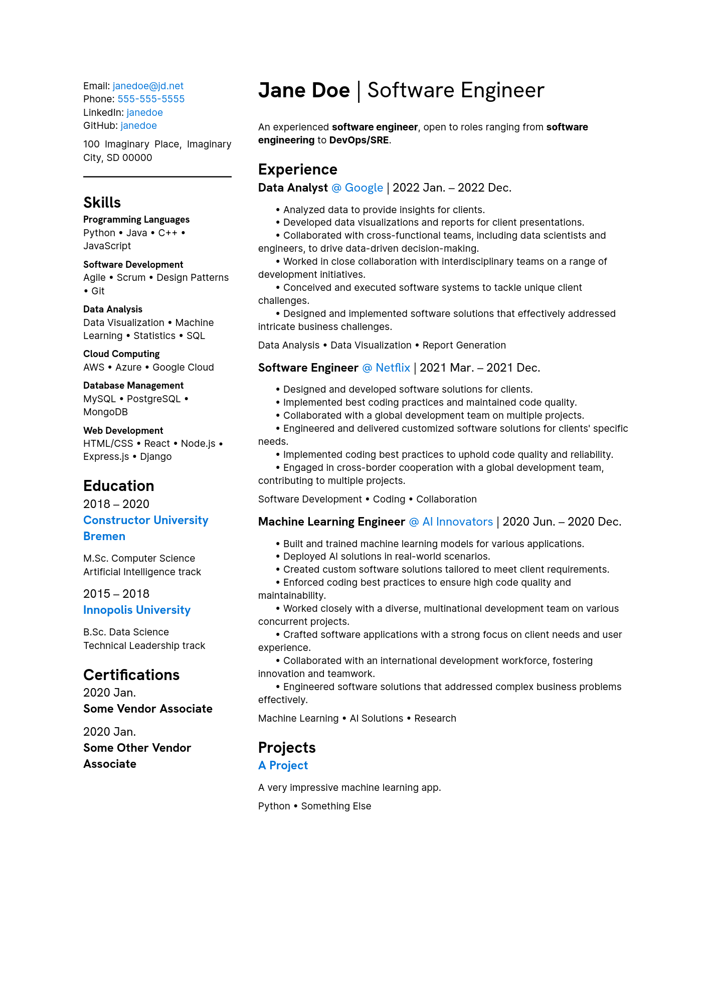

# Bare-bones Typst CV

My version of the template I forked from. Essentially just rearranged and made two different versions. `main_certs.typ` has a section for certifications.

### How to use:

1. Make an account on Typst
2. Make a new project
3. Import `main.typ` OR `main_certs.typ`
4. Import `settings.yaml`, and `configuration.yaml`

Example:

